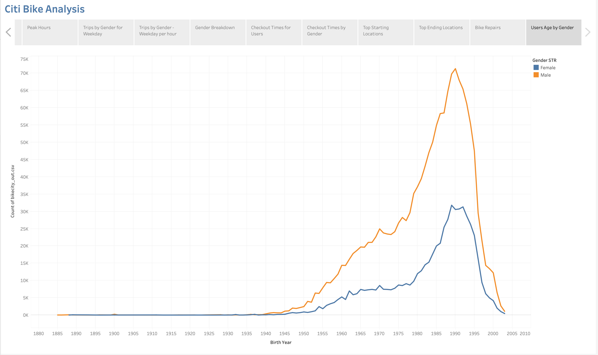

# bikesharing
## Challenge 14

In order to make this business proposal to Des Moines we requested and analysed August 2019 CitiBike data from NYC. 

Althout Des Moines is quite different than NYC, we want to demontrate that based on the NY CitiBike we think it would work for Des Moinesas well. 

This data was reviewed by looking at geographical data and data disaggregated by user types and genders. We will take a look at usage durations, peak usage times, and the key target market.

### Slide 1 - Customers in August 2019

In this slide we can see that during the month of August 2019 the CitiBike had a total of 2,344,224 rides. These rides were around 19% from customers for the day and 81% from subscribers of the service. Although most of the users are subscribers, they still can atract almost 444 thousands non regular customers.

Can we assume that most of the non-regular customers are tourists? Probably.

### Slide 2 - Trips by Weekday for each hour

During the week we can see that 7 AM to 9 AM and 5 PM to 7 PM (commute times) are the times that most of the rides start, while in the weekends the rides start all day long specially between 10 AM and 6PM (they are even throughout the day). 

### Slide 3 - Peak Hours

In general, when we dont look between the weekdays/weekends, we see that the morning peak hour is 8 to 9 AM (around 170 thousands rides) while in the afternoon we have 5 to 7 PM (around 440 thousands rides).

### Slide 4 - Trips by Gender for Weekday

The majority of customers are male in both types of users, but this prevalence is even higher with subscribers.

### Slide 5 - Trips by Gender - Weekday per hour

The usage pattern during weekdays between both genders are the same. Each of them uses bikes more during commute hours for the week days and all throughout the day during weekends.

### Slide 6 - Gender Breakdown

Here we confirm that most users are male.

### Slide 7 - Checkout Times for Users

We can see for how long the bikes are used by all riders. The large majority of users check out the bikes for a 5 minute ride. Only 982 (of 2,344,224) rides used them for 1 hour or more. There are also many rides with one minute duration.

### Slide 8 - Checkout Times by Gender

Both gender follow the same pattern.

### Slide 9 - Top Starting Locations

We can see all the starting locations and which one is more used and which are not much used. Another thing to notice is that most rides start in Manhatan.

### Slide 10 - Top Ending Locations

We can see all the ending locations and which one is more used and which are not so used. Another thing to notice is that most rides end in Manhatan.

### Slide 11 - Bike repairs

We can pin what bikes needed more repairs.

### Slide 12 - Users Age by Gender

Most users were born between 1977 and 1997.

## Results:

Analysing all these patterns, we can conclude that this business proposal will be a huge success in Des Maine as well. It would benefit the locals and tourists. Specially since the weather in Des Moines is better for outdoors.

The market target user is male, born between 1977 and 1997, that likes to bike to work, cutting traffic during commute hours.

Next Steps:

Extend the analysis by looking into the followin parameters:
- Users Age 
- Users Age by Gender
- Trip duration vs Start location
- Weather difference betwwen the 2 cities
- Traffic difference between the 2 cities
- Distance from residential area / commercial area in Des Moines
